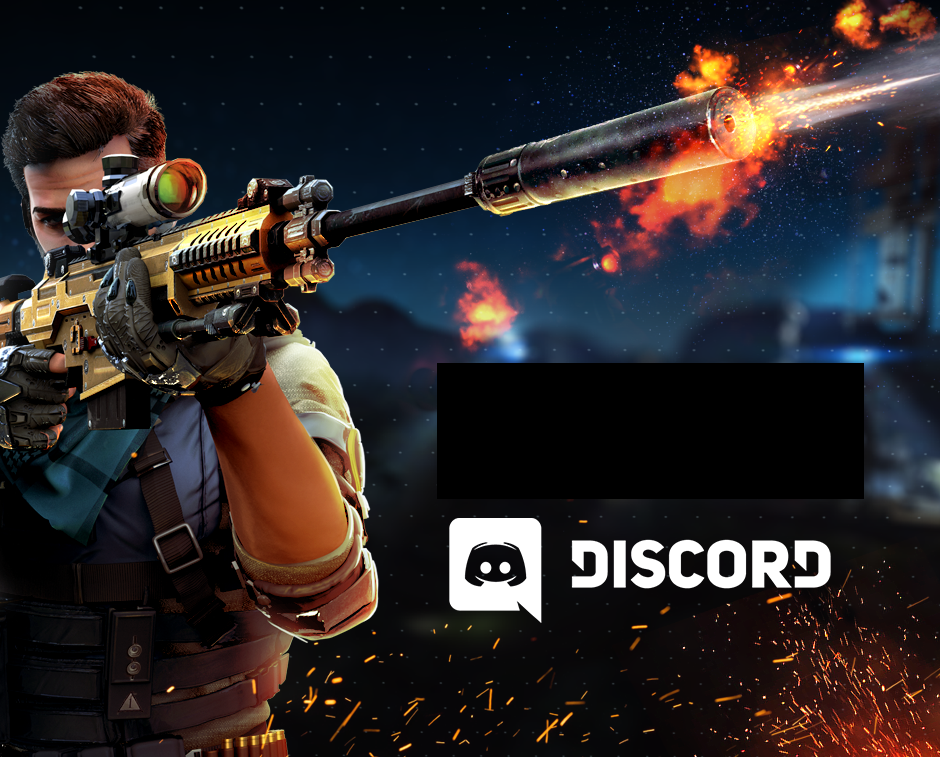

<p align="center">
  <a href="https://github.com/Don-Cryptus/echat">
    
  </a>

  <p align="center">
    <br />
    <b>Discord</b> <b>Custom</b> url <b>Sniper</b> with proxies
    <br />
    <a href="https://github.com/Don-Cryptus/DiscordCustomUrlSniper/issues">Report Bug</a>
    ·
    <a href="https://github.com/Don-Cryptus/DiscordCustomUrlSniper/issues">Request Feature</a>
    <br />
  </p>

#### 1. Prerequisites

  ```sh
  pip install -r requirements.txt
  ```

#### 2. Change vanity url that you want to snipe

```py
vanity_url = "your_url"
```

#### 3. Change it to your server ID <a href="https://www.youtube.com/watch?v=NLWtSHWKbAI">Example video</a>
```py
guild_id = "693908423486143824"
```

#### 4. Change to your webhook url <a href="https://www.youtube.com/watch?v=fKksxz2Gdnc">Example video</a>
```py
webhook = "https://discord.com/api/webhooks/693908423486143824/BwKrOBsuhjkhjkhjkhkjf26swxxjeFUPRuDaWj2LDmrJft"
```

#### 5. Change token with your Discord account token which has admin privilleges <a href="https://www.youtube.com/watch?v=TFUG3Tx50bY">Example video</a>

```py
token = "mfa.BmuKasdasdaCf9IPnlwwWb8uZTdnneBUhKLghjgsXp5rY44bPk9fRgRmMOnvdfgdfgYH1"
```
</p>

<b>P.S. if you are getting 429 Too Many Requests thats the proxies fault you have to be patient to cycle through valid proxies again</b>
